## Deep Learning and Computer Vision in R: A Practical Introduction {.title-slide-title}

::: {.title-slide-event}

BIBC2025 workshop - Introduction

:::

#### Patrick Li {.title-slide-author}

::: {.title-slide-org}

RSFAS, ANU

:::

---

## About me

I am Patrick Li

- Education background
- Current work
- Past experience in CV

---

## Content summary

- **> Overview of computer vision (CV)**
- `reticulate` basics
- Image classification
- Hyperparameter tuning
- CV model interpretation
- Object detection
- Image segmentation

---

## Disclaimer

::: {.text-80}

::: {.callout-note appearance="minimal"}

## Code and theory

This workshop is a hands-on introduction to modern computer vision in R.
You’ll work through code examples and practical exercises.
Theory will be covered only to the extent needed to understand the key ideas and statistical foundations behind the models.

:::

::: {.callout-warning appearance="minimal"}

## Reproducibility

Computer vision models can be only partly reproducible due to parallel computation.
Don’t be surprised if your results differ from those shown in the materials.

:::

::: {.callout-important appearance="minimal"}

## Hardware and time limit

Training time-consuming models will not be required during the workshop, as participants may have different hardware setups. Example training codes are provided in the materials, and exercises will focus on exploring pre-trained models.

:::

:::

---

## Expectation

 

**How confident should I be coming into this workshop?**

. . .

::: {.callout-note appearance="minimal"}

::: {style="font-size: calc(var(--r-main-font-size) * 0.8);"}

If you have a background in statistics, you are good to go! 

There will be some new concepts and terminology, but nearly everything can be explained in statistical terms. 

Don’t be intimidated by CV jargon.

:::

:::

---

## Overview of computer vision {.transition-slide}

---

## Computer vision

::: {.callout-note appearance="minimal"}

::: {style="font-size: calc(var(--r-main-font-size) * 0.75);"}

Computer vision is a broad field concerned with enabling machines to interpret and understand visual information from the world. 

:::

:::

. . .

::: {.text-75}

- **Image classification**: Assign label(s) to an entire image
- **Object detection**: Locate and classify multiple objects within an image using bounding boxes
- **Image segmentation**: Label each pixel with a class, producing a detailed mask of objects
- Image generation: Create realistic or artistic images from scratch or from a condition
- Visual Question Answering: Answer questions about an image by understanding its content
- ...

:::

---

## Early CV research (before 1980s)

::: {.callout-note appearance="minimal"}

::: {style="font-size: calc(var(--r-main-font-size) * 0.65);" .incremental}

Early CV research relied heavily on **geometric reasoning**, **algebraic formulations**, and **handcrafted rules**. 

:::

:::

::: {.text-55 .height-70}

::: {.flex-columns .height-100}

::: {.flex-1 .flex-rows}

Edge and line detection, Sobel operator (1968)

::: {.flex-1-image .popup popup-content="Sobel, I., & Feldman, G. (1968). A 3x3 isotropic gradient operator for image processing. a talk at the Stanford Artificial Project in, 1968, 271-272."}

:::

Digit recognition, N-tuple method (1959)

::: {.flex-1-image .popup popup-content="Bledsoe, W. W., & Browning, I. (1959, December). Pattern recognition and reading by machine. In Papers presented at the December 1-3, 1959, eastern joint IRE-AIEE-ACM computer conference (pp. 225-232)."}

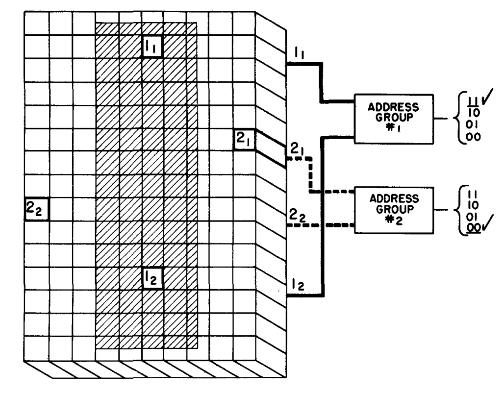

:::

:::

::: {.flex-1 .flex-rows}

Image segmentation, recursive region splitting (1978)

::: {.flex-1-image .popup popup-content="Ohlander, R., Price, K., & Reddy, D. R. (1978). Picture segmentation using a recursive region splitting method. Computer graphics and image processing, 8(3), 313-333."}

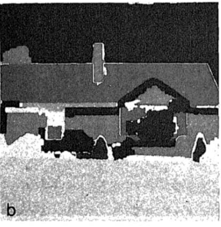

:::

Image classification, texture analysis (1973)

::: {.flex-1-image .popup popup-content="Haralick, R. M., Shanmugam, K., & Dinstein, I. H. (1973). Textural features for image classification. IEEE Transactions on systems, man, and cybernetics, (6), 610-621."}

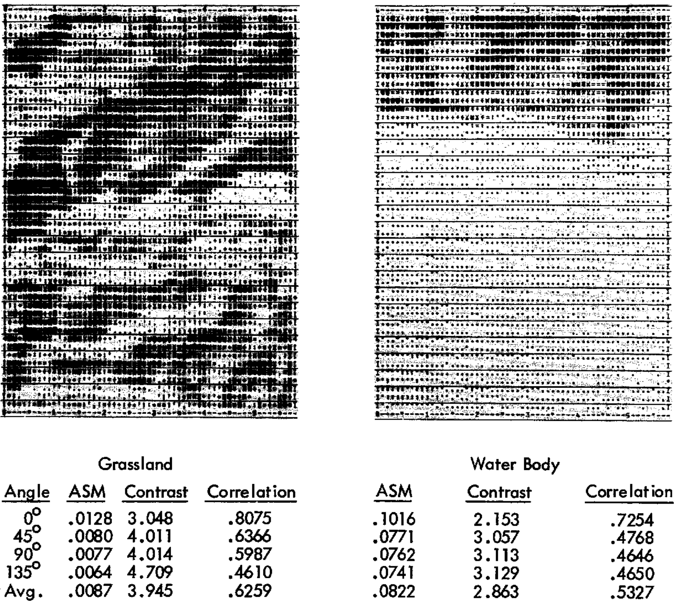

:::

:::

:::

:::

---

## Rise of CNN (1980s - 1990s)

::: {.callout-note appearance="minimal"}

::: {style="font-size: calc(var(--r-main-font-size) * 0.65);" .incremental}

The first **convolutional neural network** (CNN) **Neocognitron** was introduced in 1980, but it was LeCun’s **LeNet** for digit recognition (late 1980s – 1990s) popularized it.

:::

:::

::: {.text-55 .height-70}

::: {.flex-columns .height-100}

::: {.flex-1 .flex-rows}

Document recognition, LeNet-5 (1998)

::: {.flex-1-image .popup popup-content="LeCun, Y., Bottou, L., Bengio, Y., & Haffner, P. (1998). Gradient-based learning applied to document recognition. Proceedings of the IEEE, 86(11), 2278-2324."}

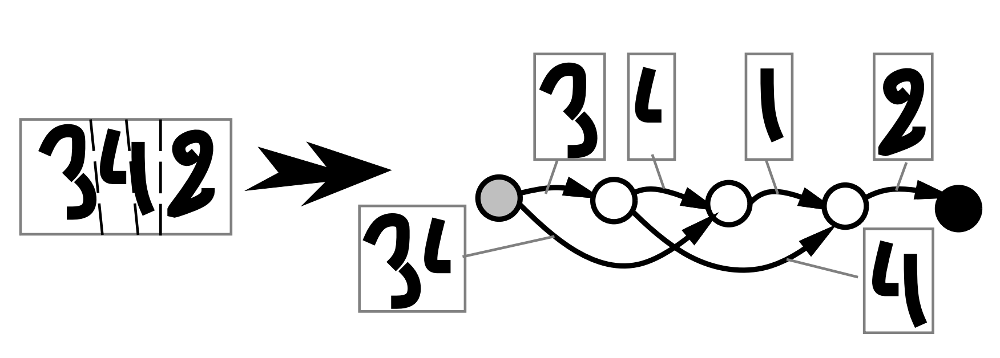

:::

Face detection (1998)

::: {.flex-1-image .popup popup-content="Rowley, H. A., Baluja, S., & Kanade, T. (1998). Neural network-based face detection. IEEE Transactions on pattern analysis and machine intelligence, 20(1), 23-38."}

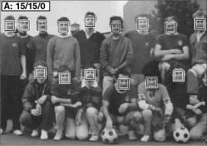

:::

:::

::: {.flex-1 .flex-rows}

Lung nodule detection (1995)

::: {.flex-1-image .popup popup-content="Lo, S. C., Lou, S. L., Lin, J. S., Freedman, M. T., Chien, M. V., & Mun, S. K. (1995). Artificial convolution neural network techniques and applications for lung nodule detection. IEEE transactions on medical imaging, 14(4), 711-718."}

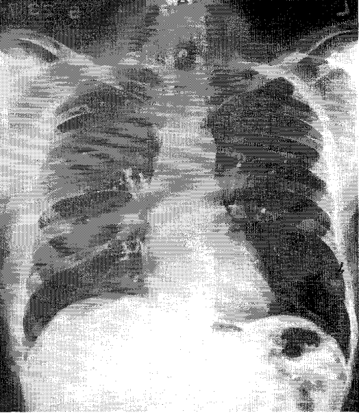

::: 

Image segmentation, Cresceptron (1992)

::: {.flex-1-image .popup popup-content="Weng, J., Ahuja, N., & Huang, T. S. (1992, June). Cresceptron: a self-organizing neural network which grows adaptively. In [Proceedings 1992] IJCNN International Joint Conference on Neural Networks (Vol. 1, pp. 576-581). IEEE."}

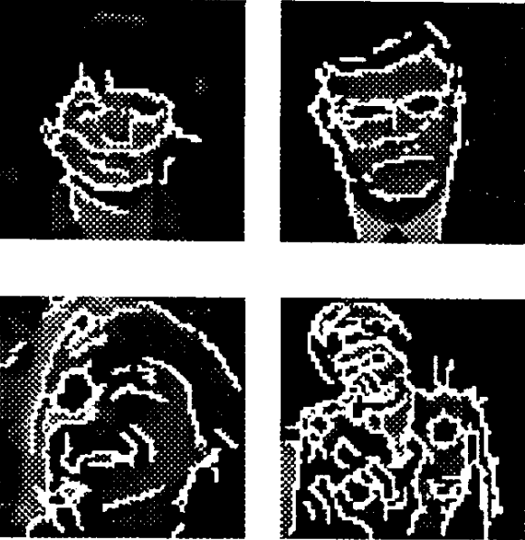

:::

:::

:::

:::

---

## Feature descriptors era (2000s)

::: {.callout-note appearance="minimal"}

::: {style="font-size: calc(var(--r-main-font-size) * 0.65);" .incremental}

During the 2000s, due to **hardware limitations**, research largely shifted toward **hand-crafted feature descriptors** and training classifiers such as SVMs on top of them.

:::

:::

::: {.text-55 .height-70}

::: {.flex-columns .height-100}

::: {.flex-1 .flex-rows}

Scale Invariant Feature Transform (2004)

::: {.flex-1-image .popup popup-content="Lowe, D. G. (2004). Distinctive image features from scale-invariant keypoints. International journal of computer vision, 60(2), 91-110."}

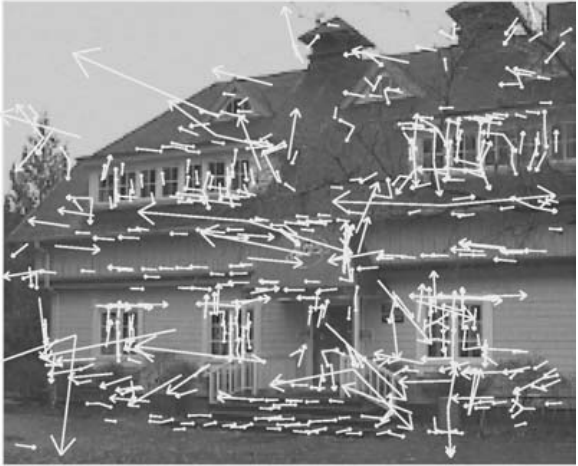

:::

Histograms of Oriented Gradients (2005)

::: {.flex-1-image .popup popup-content="Dalal, N., & Triggs, B. (2005, June). Histograms of oriented gradients for human detection. In 2005 IEEE computer society conference on computer vision and pattern recognition (CVPR'05) (Vol. 1, pp. 886-893). Ieee.
"}

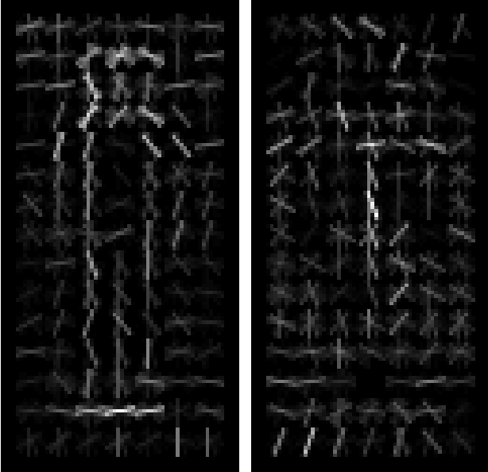

:::

:::

::: {.flex-1 .flex-rows}

Bag of visual words (2004)

::: {.flex-1-image .popup popup-content="Csurka, G., Dance, C., Fan, L., Willamowski, J., & Bray, C. (2004, May). Visual categorization with bags of keypoints. In Workshop on statistical learning in computer vision, ECCV (Vol. 1, No. 1-22, pp. 1-2)."}

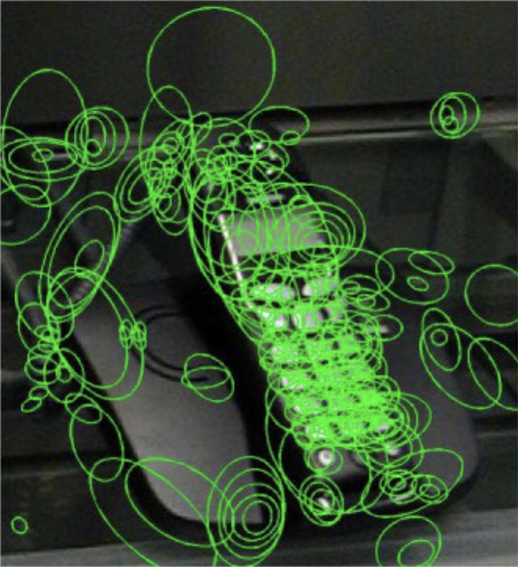

::: 

Speeded up robust features (2006)

::: {.flex-1-image .popup popup-content="Bay, H., Tuytelaars, T., & Van Gool, L. (2006, May). Surf: Speeded up robust features. In European conference on computer vision (pp. 404-417). Berlin, Heidelberg: Springer Berlin Heidelberg."}

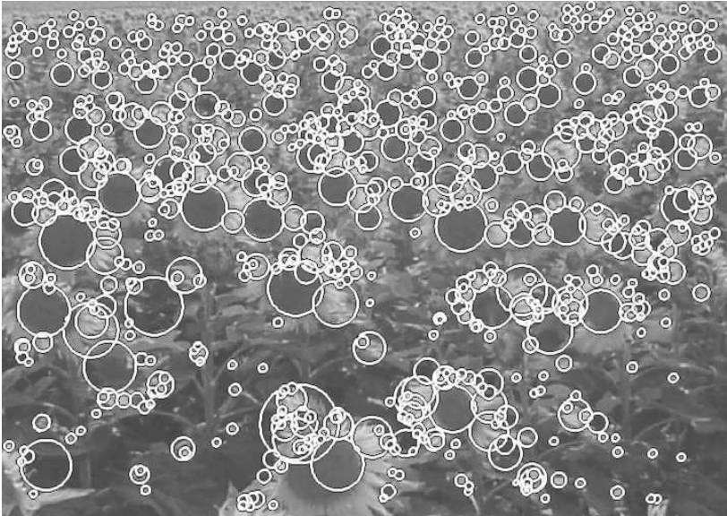

:::

:::

:::

:::

---

## CNN deep learning era (2010s)

::: {.callout-note appearance="minimal"}

::: {style="font-size: calc(var(--r-main-font-size) * 0.65);" .incremental}

Powerful GPUs and the introduction of the ImageNet Large Scale Visual Recognition Challenge (ILSVRC) sparked the rapid advancement of **modern computer vision models**.

:::

:::

::: {.text-55 .height-70}

::: {.flex-columns .height-100}

::: {.flex-1 .flex-rows}

Image classification, AlexNet (2012)

::: {.flex-1-image .popup popup-content="Krizhevsky, A., Sutskever, I., & Hinton, G. E. (2012). Imagenet classification with deep convolutional neural networks. Advances in neural information processing systems, 25."}

:::

Object detection, R-CNN (2015)

::: {.flex-1-image .popup popup-content="Girshick, R., Donahue, J., Darrell, T., & Malik, J. (2015). Region-based convolutional networks for accurate object detection and segmentation. IEEE transactions on pattern analysis and machine intelligence, 38(1), 142-158."}

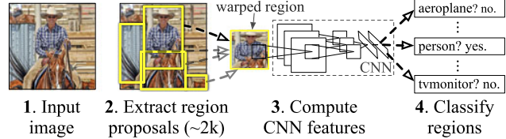

:::

:::

::: {.flex-1 .flex-rows}

Image segmentation, Fully Convolutional Network (2015)

::: {.flex-1-image .popup popup-content="Long, J., Shelhamer, E., & Darrell, T. (2015). Fully convolutional networks for semantic segmentation. In Proceedings of the IEEE conference on computer vision and pattern recognition (pp. 3431-3440)."}

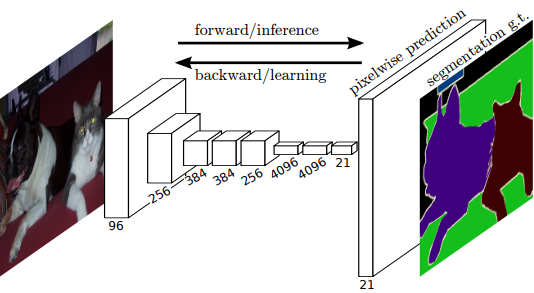

::: 

Image generation, Generative Adversarial Nets (2014)

::: {.flex-1-image .popup popup-content="Goodfellow, I. J., Pouget-Abadie, J., Mirza, M., Xu, B., Warde-Farley, D., Ozair, S., ... & Bengio, Y. (2014). Generative adversarial nets. Advances in neural information processing systems, 27."}

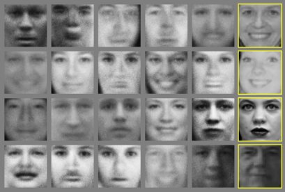

:::

:::

:::

:::

---

## Transfromer era (2020s)

::: {.callout-note appearance="minimal"}

::: {style="font-size: calc(var(--r-main-font-size) * 0.65);" .incremental}

The 2020s are defined by **transformer-based architectures**, emphasizing global context, scalability, and multi-modal learning.

:::

:::

::: {.text-55 .height-70}

::: {.flex-columns .height-100}

::: {.flex-1 .flex-rows}

Image classification, Vision Transformer (2020)

::: {.flex-1-image .popup popup-content="Dosovitskiy, A. (2020). An image is worth 16x16 words: Transformers for image recognition at scale. arXiv preprint arXiv:2010.11929."}

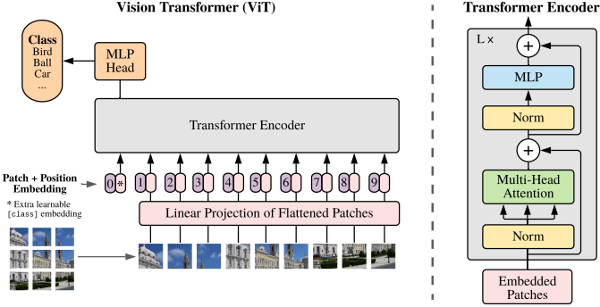

:::

Image segmentation, Segment Anything Model (2023)

::: {.flex-1-image .popup popup-content="Kirillov, A., Mintun, E., Ravi, N., Mao, H., Rolland, C., Gustafson, L., ... & Girshick, R. (2023). Segment anything. In Proceedings of the IEEE/CVF international conference on computer vision (pp. 4015-4026)."}

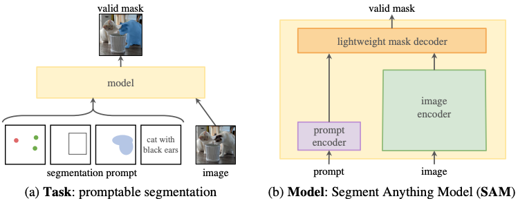

:::

:::

::: {.flex-1 .flex-rows}

Text-to-Image generation, Latent Diffusion Model (2022)

::: {.flex-1-image .popup popup-content="Rombach, R., Blattmann, A., Lorenz, D., Esser, P., & Ommer, B. (2022). High-resolution image synthesis with latent diffusion models. In Proceedings of the IEEE/CVF conference on computer vision and pattern recognition (pp. 10684-10695)."}

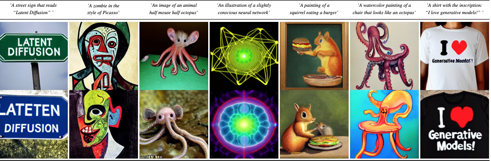

::: 

Vision question answering, Visual Language Model (2022)

::: {.flex-1-image .popup popup-content="Alayrac, J. B., Donahue, J., Luc, P., Miech, A., Barr, I., Hasson, Y., ... & Simonyan, K. (2022). Flamingo: a visual language model for few-shot learning. Advances in neural information processing systems, 35, 23716-23736."}

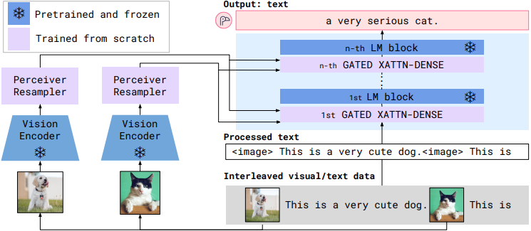

:::

:::

:::

:::

---

## What's next? (2030s)

::: {.callout-note appearance="minimal"}

::: {style="font-size: calc(var(--r-main-font-size) * 0.8);" .incremental}

- We don’t know if a breakthrough on the scale of CNNs or Transformers will occur. 

- Nor is it clear whether traditional statistical knowledge will remain relevant to future computer vision research.

- By reading the literature from the 1950s to today, you fill find less and less traditional statistics involved. 

- Research is relying more on higher-level conceptual thinking.

:::

:::

---

## Overview of CV tools and platforms {.transition-slide}

---

## Traditional CV tools and platforms

::: {.text-75}

::: {.callout-note appearance="minimal"}

::: {style="font-size: calc(var(--r-main-font-size) * 0.75);"}

Back in the day, computer vision tools were not packaged software like today but rather **collections of custom routines** written mainly in assembly, C, or Fortran.

:::

:::

::: {.fragment}

**Image processing libraries** began to emerge in 1980s, such as:

- Khoros (late 1980s)
- MATLAB Image Processing Toolbox (early 1990s)
- Intel Image Processing Library (IPL) (mid 1990s)
- **ImageJ** (late 1990s)
- **OpenCV** (2000)
- **scikit-image** (2009)

:::

:::

---

## Deep learning frameworks

::: {.text-75}

::: {.callout-note appearance="minimal"}

::: {style="font-size: calc(var(--r-main-font-size) * 0.75);"}

With CNNs gaining popularity, new open-source deep learning frameworks appeared in the 2010s.

:::

:::

::: {.fragment}

These frameworks all shares common characteristics:

- **Tensor-based computation**
  - core data structures are multi-dimensional arrays (tensors)
- **GPU acceleration**
  - computation can be offladed to GPUs for parallel processing
- **Automatic differentiation**
  - Gradient of loss with respect to parameters are computed automatically
- **Basic neural network building blocks**
  - Common layers, activations, losses, and optimizers are provided
  
:::

:::

---

## {.png-icon} Theano (2010 - 2017)

::: {.text-75}
::: {.callout-note appearance="minimal"}
::: {style="font-size: calc(var(--r-main-font-size) * 0.75);"}
**Theano** was released by the MILA Lab, Montréal around 2010.
:::
:::
- Widely used in the early 2010s for neural network research
- Forks:
  * **Theano-PyMC:** Maintained for probabilistic programming
  * **PyTensor:** Actively maintained, modernized successor with GPU and symbolic support
:::

---

## 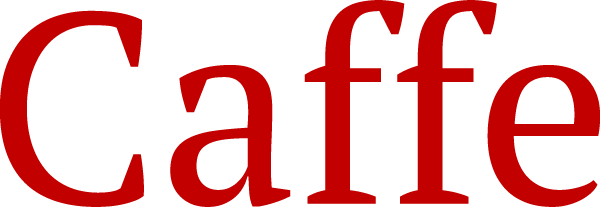{.png-icon} Caffe (2013 - 2018)

::: {.text-75}
::: {.callout-note appearance="minimal"}
::: {style="font-size: calc(var(--r-main-font-size) * 0.75);"}
**Caffe** was released by UC Berkeley in December 2013 by Yangqing Jia.
:::
:::
- Dominated computer vision research and industry applications (2013 - 2016)
- Forks:
  * **Caffe2:** Facebook's production-focused successor (2017)
  * **OpenCaffe:** Community maintenance efforts
  * Merged into **PyTorch** ecosystem (2018)
:::

---

## {.png-icon} CNTK (2015 - 2019)
::: {.text-75}
::: {.callout-note appearance="minimal"}
::: {style="font-size: calc(var(--r-main-font-size) * 0.75);"}
**CNTK** (Microsoft Cognitive Toolkit) was released by Microsoft Research in 2015.
:::
:::
- Strong performance in speech recognition and reinforcement learning
- Legacy:
  * **Archived:** Code available but no active development
  * **ONNX:** Microsoft's contributions live on in the Open Neural Network Exchange format
  * Users migrated primarily to **PyTorch** and **TensorFlow**
:::

---

## 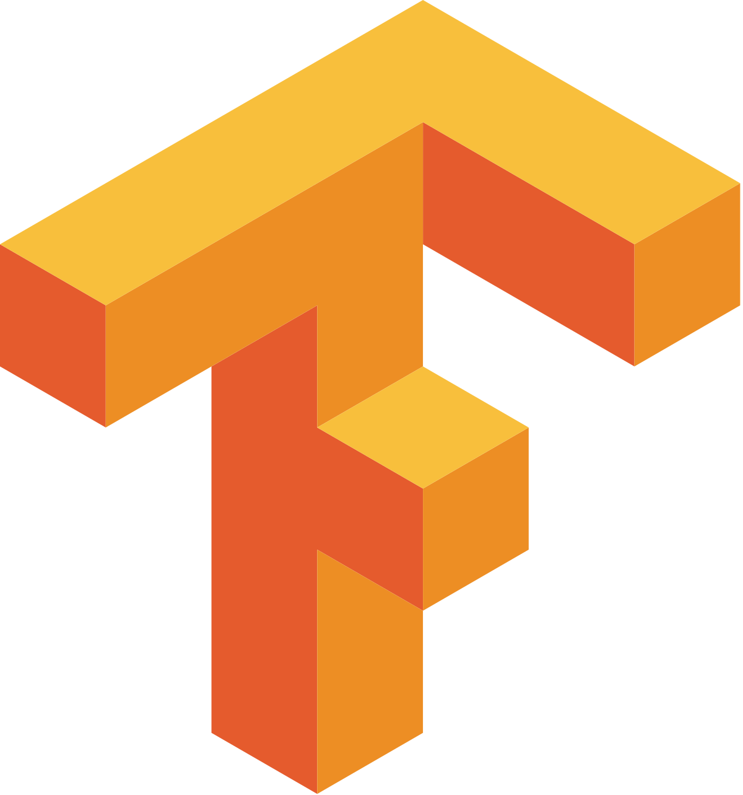{.png-icon} TensorFlow (2015 - present)

::: {.text-75}
::: {.callout-note appearance="minimal"}
::: {style="font-size: calc(var(--r-main-font-size) * 0.75);"}
**TensorFlow** was released by Google Brain in November 2015.
:::
:::
- Dominated industry and research (2016 - present), stable v1.0.0 in 2017
- Current Status:
  * **TensorFlow 2.x:** Actively maintained with **Keras** as official high-level API
  * **TensorFlow Lite:** Mobile and embedded deployment
  * **TensorFlow.js:** Browser-based machine learning
:::

---

## {.png-icon} Keras (2015 - present)
::: {.text-75}
::: {.callout-note appearance="minimal"}
::: {style="font-size: calc(var(--r-main-font-size) * 0.75);"}
**Keras** was released by François Chollet in March 2015.
:::
:::
- High-level, user-friendly API designed to run on top of **TensorFlow**, **Theano**, or **CNTK** with a focus on fast experimentation
- Became the most popular high-level neural networks API (2015 - 2019)
- Current Status:
  * **tf.keras:** Integrated into **TensorFlow 2.0** as default API
  * **Keras 3.0 (2023):** Multi-backend support (**TensorFlow**, **JAX**, **PyTorch**)
  * Actively maintained by Google and the community
:::

---

## {.png-icon} PyTorch (2017 - present)
::: {.text-75}
::: {.callout-note appearance="minimal"}
::: {style="font-size: calc(var(--r-main-font-size) * 0.75);"}
**PyTorch** was released by Facebook AI Research (FAIR) in January 2017.
:::
:::
- Rapidly gained popularity in research community, absorbed **Caffe2 (2018)**
- PyTorch Foundation: Established under Linux Foundation (September 2022)
- Current Status:
  * **Dominates research:** ~95% market share with **TensorFlow**
  * **torchvision, torchaudio, torchtext:** Rich ecosystem of domain libraries
:::

---

## {.png-icon} JAX (2018 - present)
::: {.text-75}
::: {.callout-note appearance="minimal"}
::: {style="font-size: calc(var(--r-main-font-size) * 0.75);"}
**JAX** was released by Google Research in December 2018.
:::
:::
- Not a traditional DL framework — a numerical computing library with autodiff
- Growing adoption in research, especially at Google Brain and DeepMind
- Current Status:
  * Actively maintained by Google Research
  * **Focus:** Advanced research, scientific computing, and custom architectures
:::

---

## Choice for this Workshop

::: {.callout-note appearance="minimal"}

We will use **PyTorch** as the backend and **Keras** as the high-level API.

Keras was originally tied to **TensorFlow**, but TensorFlow development has slowed, and internal interest at Google seems to have decreased, similar to other past Google products.

**Keras 3.0** now supports multiple backends, so the same code can run on **TensorFlow**, **PyTorch**, or **JAX**.

Today, **PyTorch** is the main choice for research and fast experimentation, and most new models are built with it.

:::
